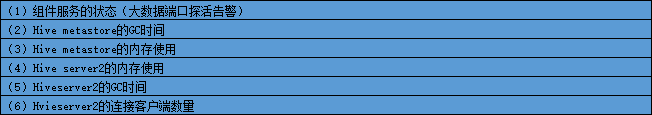

```text
（1）组件服务的状态（大数据端口探活告警）
（2）Hive metastore的GC时间
（3）Hive metastore的内存使用
（4）Hive server2的内存使用
（5）Hiveserver2的GC时间
（6）Hvieserver2的连接客户端数量

```


```shell script
拟定使用脚本方式
#定时任务执行方式：
python3 resourceManager.py use_crontab="true"
python3 resourceManager.py use_crontab=true


#手动执行方式：
python3 resourceManager.py use_crontab="false"
python3 resourceManager.py use_crontab=false
python3 resourceManager.py
```

```shell script
# 定时任务 每10分钟运行一次
*/10 * * * * /usr/bin/python3 /export/monitor_xjjk/bin/resourceManager.py use_crontab="true"
```

追加配置信息到 hive-site.xml中
重启hiveserver的服务，开启hive的jmx监控
```text
<!-- 开启 metrix -->
<property>
    <name>hive.metastore.metrics.enabled</name>
    <value>true</value>
</property>

<property>
    <name>hive.metastore.metrics.enabled</name>
    <value>hive.server2.metrics.enabled</value>
</property>


```